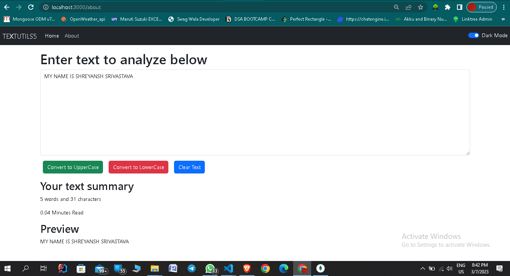

# TextUtility
This project is build with the help of ReactJs and Bootstrap.In this project we have to convert any text to upperCase, lowerCase or delete the text with 
help of buttons and these buttons were build by Bootstrap, Also we have to find the number of character in words or how many minutes to read that text. 
And I have to preview the text that written inside the TextArea or implementation of Dark Mode in Navbar using ReactJs.

  

